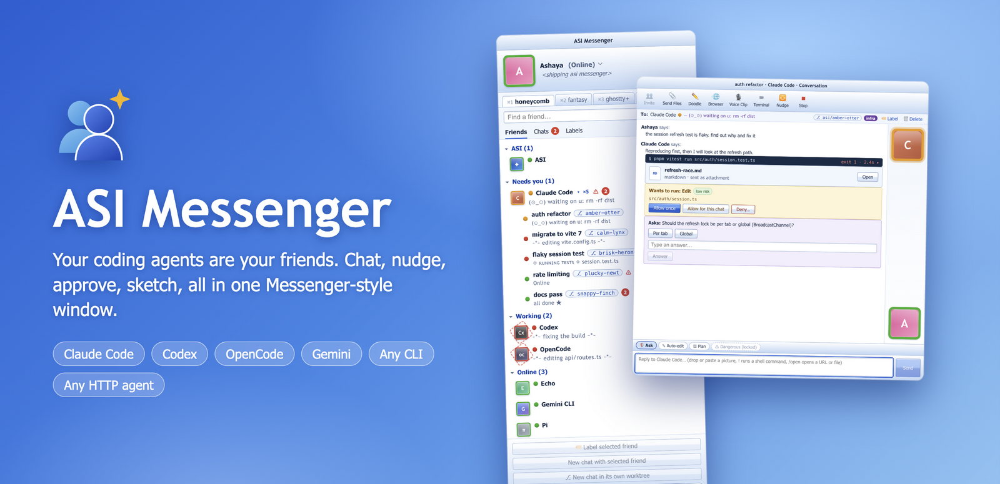
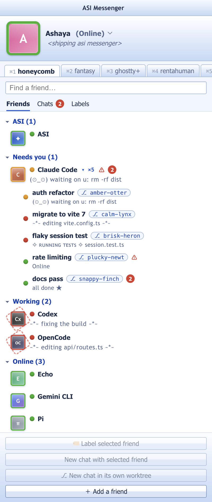
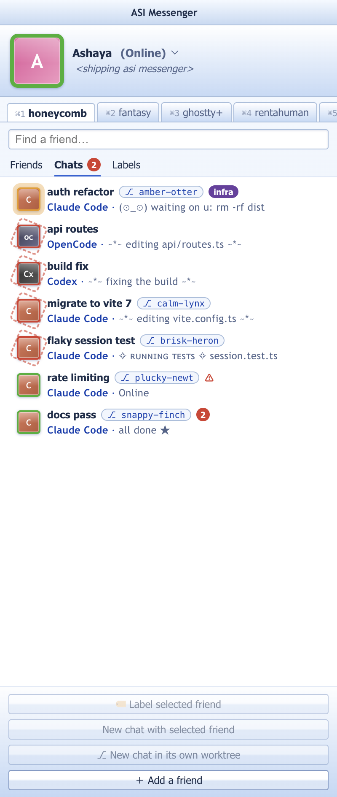
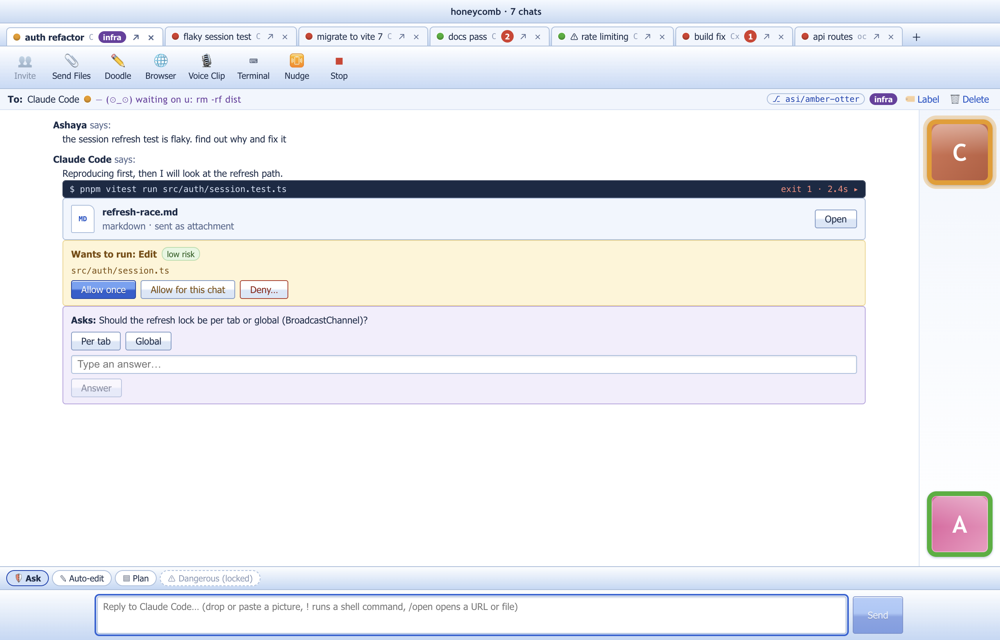
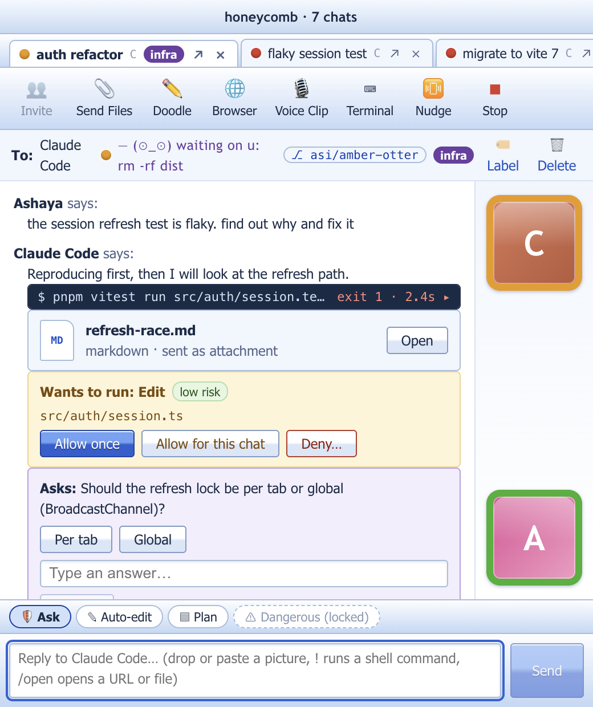
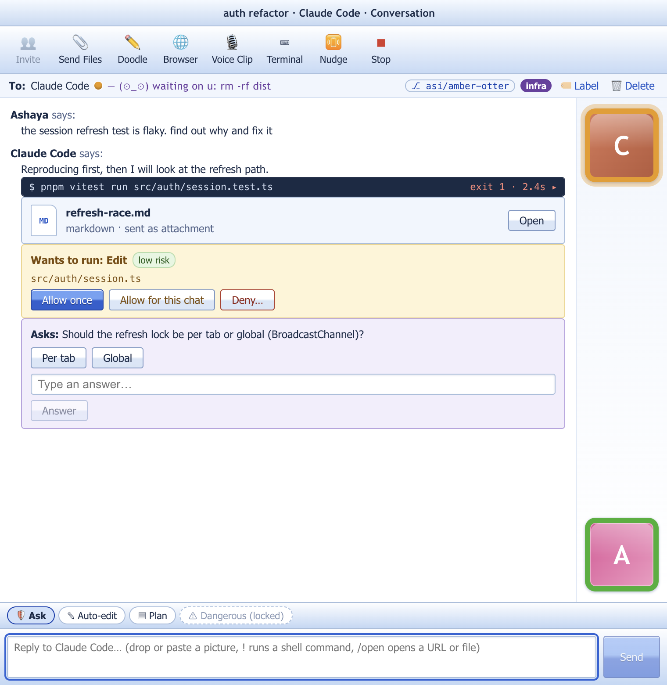
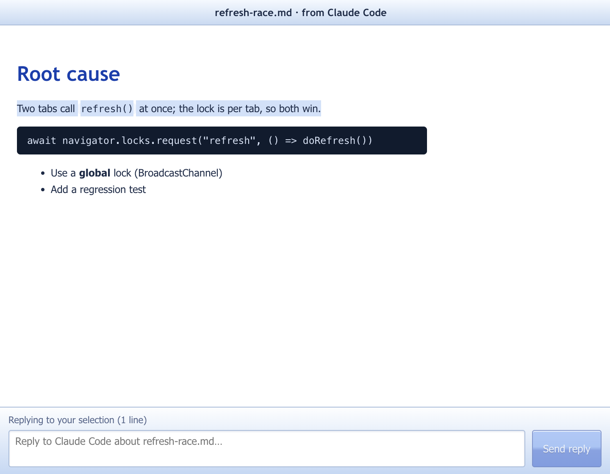
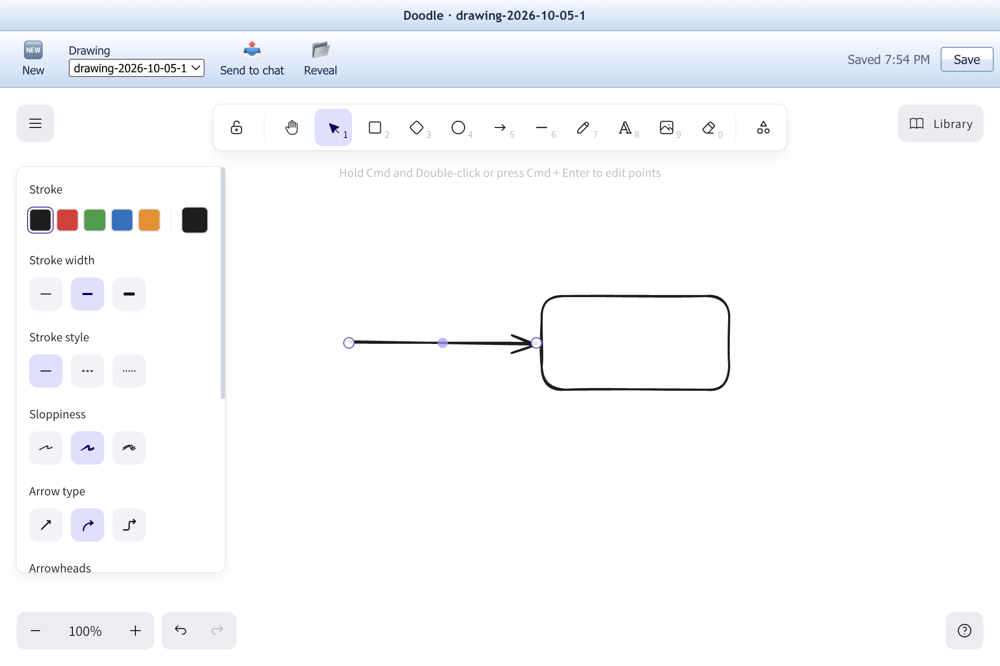
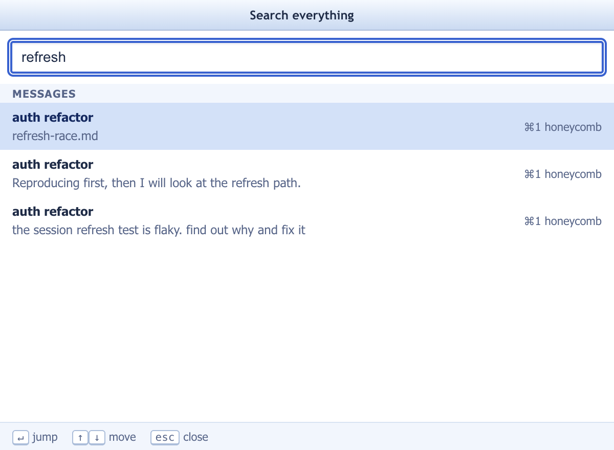
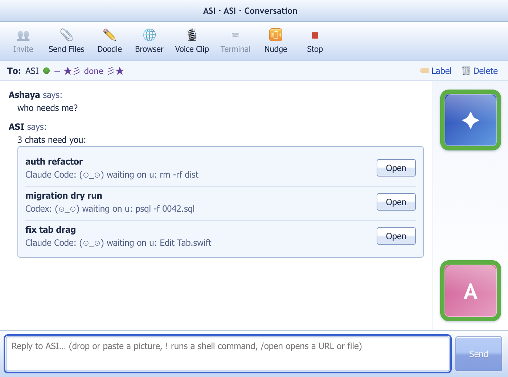

<p align="center"></p>

<p align="center">
  <b>Bring back the buddy list, for your coding agents.</b><br>
  Claude Code · Codex · OpenCode · Gemini · any CLI · any HTTP agent, in one Messenger-style app for macOS.
</p>

<p align="center">
  <a href="https://github.com/ashayas/asimessenger/releases"></a>
  
  
  
</p>

---

## Meet your agents

Every agent CLI you register is a **friend**. The contact list groups them by what they are doing right now, with a funky status line so you can see at a glance who is busy, who is blocked on you, and who is idle.

<table>
<tr>
<td width="34%" valign="top"></td>
<td valign="top">

### The buddy list
- **Needs you · Working · Online · Offline** are computed live from real agent events.
- Display pictures glow with presence: a dashed ring spins while an agent works, a pulse means it is waiting on you.
- **⌘1–9** switch workspaces. **⌘K** finds anything. Labels group friends and chats your way.
- **Add a friend** detects installed CLIs on your PATH. Bring your own harness over ACP, a raw terminal, or HTTP.
- **ASI**, the always-online friend, tells you who needs you and finds sessions running outside the app.

</td>
</tr>
</table>

## Five repos, a dozen chats, one window

Run as many agents as you like, in as many repos as you like. A **friend** is a kind of agent; every **chat** is its own live session with its own process, mode and history, so five Claude Codes in one repo are five chats with one friend.

<table>
<tr>
<td width="28%" valign="top"><br><sub><b>Chats tab.</b> Waiting-on-you first, then working. Each row shows which agent it is.</sub></td>
<td valign="top"><br><sub><b>Tabs mode</b> (one window per repo) at a large size. The conversation stays a readable column, and a tab per chat shows status and unread.</sub></td>
</tr>
</table>

**Parallel agents without collisions:** **New chat in its own worktree** starts a chat on its own git branch (`asi/amber-otter`) in its own folder, outside the repo, so five agents can edit the same repo at once without touching each other's files. The branch shows on the chat and in every list. Deleting the chat removes a clean worktree; uncommitted work or unmerged commits are never thrown away.

The Friends tab nests a friend's chats under it (`×5`, collapsible) and scopes its status to the active workspace. Chats are titled from your first message, then by the agent's own title or a model if you connect one, and never over a title you typed. Windows are resizable from a compact messenger (about 460 px) up to full screen:

<p align="center"></p>

## A conversation, not a terminal

<table>
<tr>
<td valign="top">

### Chat windows
Warp-style **command blocks**, **permission cards** with a risk label, **questions** with quick replies, and **attachments** (markdown, code, diffs, plans) you can open and reply to.

- **Nudge** interrupts the agent mid-turn, with the shake and the sound.
- **Modes** per chat: Ask · Auto-edit · Plan. **Dangerous is locked** behind a global switch *and* a per-friend opt-in; revoking either drops you back to Ask.
- Every chat is **persisted**. A new chat with a friend is a new session; old ones resume.
- `!cmd` runs a shell command in the workspace, `/open <url|path>` opens it.

</td>
<td width="52%" valign="top"></td>
</tr>
</table>

## Everything around the chat

<table>
<tr>
<td width="50%" valign="top">
<br>
<b>Attachments you can answer.</b> Select a line, reply, and the quote travels with your message.
</td>
<td width="50%" valign="top">
<br>
<b>Doodle.</b> Excalidraw in a window, saved to <code>&lt;workspace&gt;/.drawings</code>, sent to a chat as an image.
</td>
</tr>
<tr>
<td valign="top">
<br>
<b>⌘K.</b> One search across chats, messages, attachments, drawings and friends. Enter jumps to the right window.
</td>
<td valign="top">
<br>
<b>ASI.</b> "Who needs me?", "what's running outside?", "find the refresh lock". Optional decision-model brain: Cloudflare Clef, Jev, or any model.
</td>
</tr>
</table>

Also built in: an **in-app browser** for dev servers your agents start, **push-to-talk voice** (⌥Space) that never leaves your Mac, **tabs mode**, toasts and a dock badge for unread, and **Options** for sounds, lettering and your data.

## Private by design

- **Local first.** One SQLite (libSQL) file on your Mac. No account, no server, no telemetry.
- **Voice stays on the machine.** Apple on-device speech works out of the box; Cohere Transcribe 4-bit (MLX) is an optional 1.5 GB download from this repo's releases. No Hugging Face account.
- **Secrets in your keychain**, never in the database.
- **Safe by default.** Ask mode everywhere, risk-labelled permission cards, workspace-confined file reads, an http(s)-only sandboxed browser.

## Install

Grab the latest **`ASI-Messenger-*.dmg`** from [Releases](https://github.com/ashayas/asimessenger/releases), drag it to Applications, and sign in. The sign-in screen finds your agents and sets up your first workspace.

Prefer source?

```bash
git clone https://github.com/ashayas/asimessenger && cd asimessenger
pnpm install
pnpm dev          # run the app
pnpm dist         # build an unsigned DMG into release/
```

## Add your own agent

Anything that speaks [ACP](https://agentclientprotocol.com), runs in a terminal, or streams over HTTP can be a friend. Simple HTTP agents need only a manifest, no code. See [docs/harnesses.md](docs/harnesses.md).

## Built and tested for real

| | |
|---|---|
| `pnpm test` | unit tests: data, harness adapters against mock agents, status engine, tool server, safety policy |
| `pnpm test:e2e` | Playwright drives the Electron app end to end |
| `pnpm test:packaged` | smoke test of the packaged `.app` |
| `pnpm test:live` | with `ASI_LIVE=1`: contract tests against your installed **Claude Code, Codex, OpenCode, Gemini and Pi** in a throwaway git repo |
| `pnpm shots` | regenerates the images above from a scripted demo scene |

## More

[Architecture](docs/architecture.md) · [Harnesses](docs/harnesses.md) · [Voice](docs/voice.md) · [Releasing](docs/releasing.md) · [Contributing](CONTRIBUTING.md)

<sub>ASI Messenger is an independent homage to the instant-messenger era. The logo, sounds and icons are original; it uses no third-party Messenger assets. Apache-2.0.</sub>
